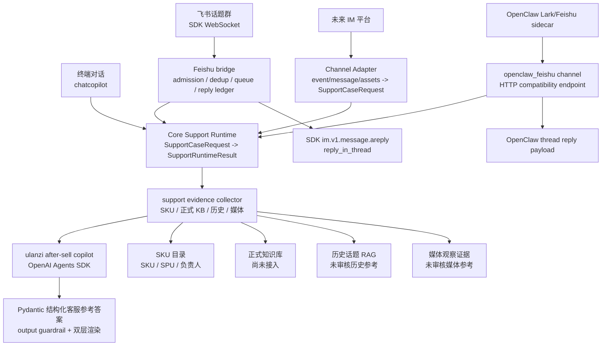

# ulanzi after-sell copilot

本仓库是 `ulanzi after-sell copilot` 的运行时，用于在终端和飞书话题群中提供售后客服场景的 AI 辅助分析能力。

当前测试目标很明确：通过 OpenAI Agents SDK 的售后支持 Agent，验证 SKU 识别、答案格式、安全边界、历史话题 RAG，以及飞书 SDK 长连接接入后的线程内回复稳定性。

## 当前运行时



运行规则：

- 终端和 legacy 飞书 SDK 长连接是当前稳定交互入口。
- OpenClaw Feishu sidecar path 已提供 compatibility endpoint 和 contract smoke，用于下一阶段替代 legacy 飞书通道；真实飞书群 E2E 需要凭证环境验证。
- Core Support Runtime 只消费 `SupportCaseRequest` 并输出 `SupportRuntimeResult`，不 import 飞书 SDK、OpenClaw 或 channel 模块。
- 新 IM 平台通过独立 `channels/<platform>/adapter.py` / `responder.py` 接入同一个 Core Runtime，不复制 Agent 编排。
- Legacy 飞书链路只使用官方 Python SDK，不依赖额外命令行桥接工具。
- 飞书事件只处理白名单话题群内真实用户 @ 机器人后的文本消息。
- legacy 飞书链路默认不响应纯图片/视频/文件消息；如需在测试群验证图片-only intake，必须同时配置
  `FEISHU_SUPPORT_GROUP_CHAT_ID` 和 `FEISHU_MEDIA_AUTO_ACCEPT_ENABLED=true`，避免机器人在非白名单群里响应任意媒体消息。
- 飞书回复强制使用 `im.v1.message.areply` 的 `reply_in_thread=true`，不会 fallback 到主群新消息。
- 启动面板展示项目名称、版本、当前模型、计费模式和项目路径。
- 输入状态只保留上下文数量和当前模型。
- 旧 Web Demo 和通用公开 HTTP API 不作为当前运行入口；保留的 HTTP 面只用于受控 channel compatibility endpoint。legacy 飞书生产链路仍不使用公网 webhook。
- 旧的本地确定性匹配分析器和演示种子知识已经从运行时移除。
- `search_sku_catalog` 使用 `data/sku_catalog/` 下的真实合并 SKU 目录。
- 正式知识库工具当前返回明确的“未查询到可信正式依据”。
- `search_issue_history` 已接入飞书 raw JSON 历史话题 RAG，但只作为未审核历史参考，不能作为正式依据、政策依据或客户承诺依据。
- 当前 v2 loop 由 runtime 先构造 `SupportCaseRequest`，经过 intake route、ingestion artifact 和 `UnifiedCaseContext` 后，再调用 `collect_support_evidence()` 并发收集 SKU、正式依据、历史参考和媒体观察证据，最后把统一上下文、数据源覆盖和结构化证据包交给 Agent 生成 `SupportAnswer`。
- Agent 最终输出经过 SDK output guardrail 和本地答案 contract 校验；终端保留中文 11 字段调试格式，飞书群可见回复会再渲染成面向客服同事的自然中文。
- 答案不得编造正式文档、历史案例、链接、负责人、政策或技术结论。

## 运行方式

```bash
python3.10 -m venv .venv
source .venv/bin/activate
pip install -c constraints.txt -e ".[dev]"
cp .env.example .env
```

运行时需要 Python 3.10+。在 `.env` 中填写模型与 tracing 配置后启动终端 Agent：

```bash
chatcopilot
```

启动飞书 SDK 长连接：

```bash
feishu-long-connection
```

飞书生产部署使用 systemd 托管同一入口：

```bash
python -m agent_runtime.feishu.long_connection
```

OpenClaw Feishu sidecar compatibility endpoint 随 FastAPI app 暴露：

```bash
uvicorn agent_runtime.feishu.webhook:app --host 127.0.0.1 --port 8000
curl -s http://127.0.0.1:8000/channels/openclaw-feishu/health
cd deploy/openclaw_sidecar
nvm use 22.22.2
corepack npm run smoke:support-copilot
```

sidecar 环境样例和真实飞书群验收清单位于 `deploy/openclaw_sidecar/`。OpenClaw path 稳定前，legacy `feishu-long-connection` 保留为 fallback。

开发时也可以继续使用 `make chat`，它底层同样运行 `agent_mvp.py`。

终端命令：

- `/model`：在 Flash 和 Pro 预设之间切换。
- `/clear`：清除当前终端会话上下文。
- `/compact`：将当前会话压缩成一条摘要上下文。
- `/info`：打开内联 Agent/工具信息窗口；支持 ↑/↓、Enter、q/Esc。
- `/status`：查看模型、tracing 和 SKU 目录路径。
- `/agents`：查看当前 Agent 名称。
- `/tools`：查看当前工具名称。
- `/help`：查看命令。
- `/bye`：退出。

模型预设由 `.env` 控制：

```env
SUPPORT_AGENT_MODEL_FLASH=deepseek-v4-flash
SUPPORT_AGENT_MODEL_PRO=deepseek-v4-pro
SUPPORT_AGENT_BILLING_MODE=API Usage Billing
SUPPORT_INTAKE_ROUTER_ENABLED=false
SUPPORT_CONTEXT_ASSEMBLER_ENABLED=false
SUPPORT_OCR_PROVIDER=disabled
SUPPORT_VECTOR_INDEX_NAMESPACE=after_sales_v1
```

`LLM_API_KEY` 只用于实际模型调用，例如 DeepSeek 的 OpenAI-compatible endpoint。`OPENAI_TRACING_API_KEY` 只用于向 OpenAI Platform 导出 Agents SDK traces；当使用非 OpenAI 模型且开启 tracing 时，两者应分开配置。

飞书桥接至少需要以下配置：

```env
FEISHU_APP_ID=cli_xxx
FEISHU_APP_SECRET=
FEISHU_SUPPORT_GROUP_CHAT_ID=oc_xxx
FEISHU_BOT_MENTION_NAME=飞书 CLI
FEISHU_RUNTIME_DB_PATH=data/feishu_runtime/runtime.sqlite3
SUPPORT_AGENT_SESSION_DB_PATH=data/feishu_runtime/agent_sessions.sqlite3
FEISHU_EVENT_CONCURRENCY=5
FEISHU_BACKFILL_ENABLED=true
FEISHU_BACKFILL_INTERVAL_SECONDS=10
FEISHU_BACKFILL_LOOKBACK_SECONDS=180
```

## 答案格式

Agent 内部结构化输出和终端调试输出必须按以下顺序保留字段：

1. `问题类型`
2. `运行模式`
3. `置信度`
4. `用户问题摘要`
5. `SKU 命中`
6. `建议回复（供客服参考，可复制调整）`
7. `建议排查步骤`
8. `需要追问`
9. `正式依据`
10. `历史参考`
11. `工单草稿`

如果某个字段不能由已接入工具或高置信度推理支持，必须明确说明不能确认，不能填充虚假内容。

飞书群可见回复不直接暴露这些字段名、`Agent SDK`、证据包、trace/tool/guardrail 等内部信息，也不使用 Markdown 标题、列表、表格或代码块。飞书回复会把结构化结果改写成 2-4 段自然中文，面向客服同事说明判断、可沟通口径、需要补充的信息和安全边界。

## 上下文

终端运行时使用内存中的 SDK `SQLiteSession`。同一个 `chatcopilot` 进程内的正常对话共享会话，后续问题可以看到前文；重启终端后会开启新的内存会话。

飞书运行时按 `chat_id + thread_id/root_id/message_id` 隔离 session、队列和 tracing group。同一话题串行处理，不同话题可并行处理。运行时 SQLite 台账位于 `FEISHU_RUNTIME_DB_PATH`，用于记录 dedup、回复状态和错误摘要；Agent 多轮上下文位于 `SUPPORT_AGENT_SESSION_DB_PATH`，同一飞书话题可跨消息共享历史。长连接入口默认启用短周期 backfill，会按 `FEISHU_BACKFILL_LOOKBACK_SECONDS` 回扫测试群最近消息，兜底 Feishu SDK WebSocket 漏推；回扫消息仍走同一 admission、dedup、queue 和 reply ledger。

- `/clear` 会删除所有 session item。
- `/compact` 会用当前模型压缩会话，清除旧内容，并保留一条摘要。
- `SUPPORT_AGENT_SESSION_LIMIT` 控制每轮传回模型的最新 session item 数量，默认值为 `40`。

## 关键参考

- 资料索引：[docs/source-index.md](docs/source-index.md)
- Obsidian 总设计笔记：[docs/obsidian-master-note.md](docs/obsidian-master-note.md)，该文件是指向 Obsidian vault 的软链接。
- OpenAI Traces 仪表盘：https://platform.openai.com/logs?api=traces

## 项目地图

- `agent_mvp.py`：`ulanzi after-sell copilot` 的终端对话入口。
- `src/agent_runtime/copilot/`：Agent prompt、结构化答案 contract、case/context schema、intake router、ingestion pipeline、context assembler、证据包模型和 evidence collector。
- `src/agent_runtime/feishu/`：飞书 SDK 长连接、入站 gate、SQLite runtime store、per-thread queue 和线程内回复。
- `src/agent_runtime/tools/sku_catalog.py`：合并 SKU 目录查询。
- `src/agent_runtime/tools/rag.py`：正式知识库检索占位和混合证据打包入口，统一返回 SKU 精准匹配、文本历史参考和媒体观察证据。
- `src/agent_runtime/tools/history_rag.py`：读取本地历史话题索引，调用阿里云百炼 `text-embedding-v4` / `qwen3-rerank`。
- `src/agent_runtime/tools/media_rag.py`：读取媒体观察证据索引，对已下载图片使用 `qwen3-vl-embedding` / `qwen3-vl-rerank`，未下载媒体保留元数据 fallback。
- `src/agent_runtime/tools/ticket.py`：需要人工确认的工单草稿工具。
- `src/agent_runtime/llm.py`：Agents SDK 模型和 tracing 配置。
- `scripts/build_sku_support_catalog.py`：将产品表和 SKU 表合并为客服场景使用的 SKU 匹配目录。
- `scripts/build_history_rag_index.py`：从飞书 raw topic JSON 构建文本历史话题索引。
- `scripts/build_media_evidence_index.py`：从飞书 raw media 元数据和话题上下文构建媒体观察证据索引；`--provider bailian_vl` 会对本地图片生成多模态融合向量。
- `scripts/ingest_feishu_support_data.py`：飞书 IM 到 Base 的采集工具；不再生成本地规则式处理建议。
- `docs/sku-support-catalog.md`：SKU 匹配目录的字段映射和合并规则。
- `docs/tracing.md`：模型调用和 OpenAI Traces 导出说明。
- `data/sku_catalog/`：本地完整 SKU 导出和合并结果，因包含公司 SKU 数据而被 git 忽略。

## 当前数据状态

- SKU 目录：`data/sku_catalog/processed/2026-05-26/sku_support_catalog-2026-05-26.csv`
- 历史话题 RAG 索引：`data/history_rag/index/latest`，因包含 raw topic 派生产物而被 git 忽略。
- 媒体观察证据索引：`data/media_rag/index/latest`，因包含 raw media 派生产物而被 git 忽略。
- 飞书 Base 归档：https://ulanzichina.feishu.cn/base/JDWwbG7rRaeoZksPe1TchVyWnif
- 云盘图片归档：https://ulanzichina.feishu.cn/drive/folder/HRdOft9QHlXeCSdAh9hcSMXlnsc

飞书 Base、图片归档和 raw topic JSON 是未来已审核案例卡片/RAG 流程的原始材料。终端 Agent 可以引用未审核历史话题和未审核媒体观察作为内部参考，但必须标注“需人工确认”，且不能把它直接当作正式答案依据。
