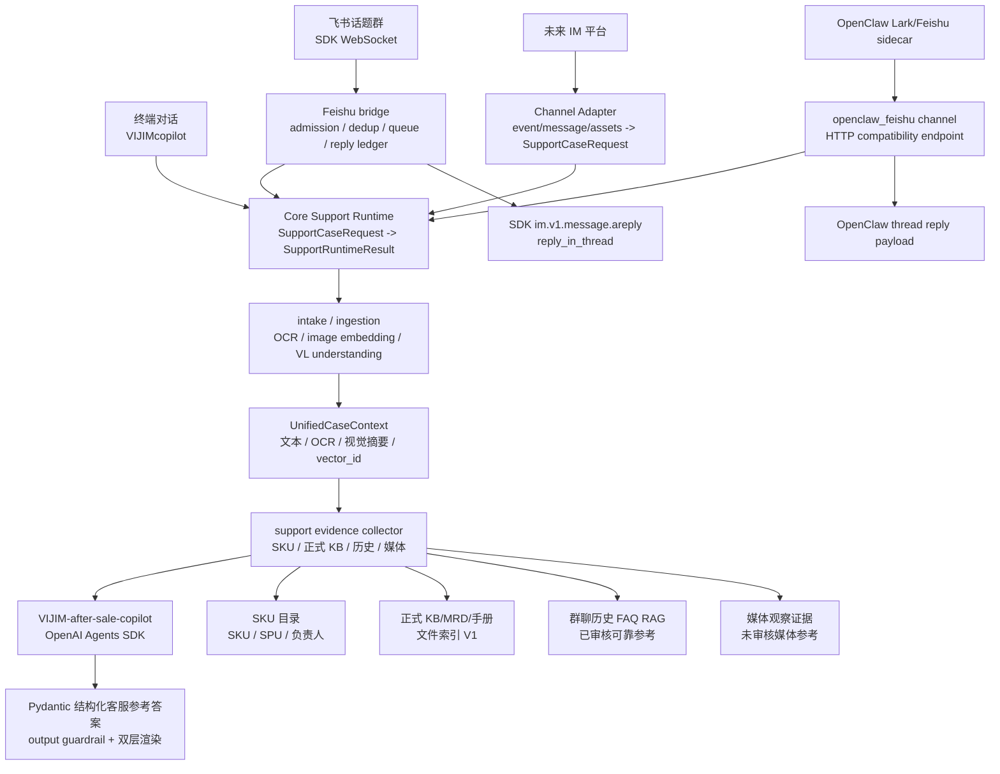

# VIJIM-after-sale-copilot

本仓库是 `VIJIM-after-sale-copilot` 的运行时，用于在终端和飞书话题群中提供售后客服场景的 AI 辅助分析能力。

当前测试目标很明确：通过 OpenAI Agents SDK 的售后支持 Agent，验证 SKU 识别、答案格式、安全边界、历史话题 RAG，以及飞书 SDK 长连接接入后的线程内回复稳定性。

## 当前运行时



运行规则：

- 开发与部署基准见 [docs/development-baseline.md](docs/development-baseline.md)：GitHub 是唯一长期代码基准；服务器 `/opt/agent-runtime-dev` 是 Agent Runtime dev 开发工作区；服务器 `/opt/agent-runtime` 是 Agent Runtime 生产部署目录；本地工作区只做轻量调试和快速验证。
- 终端和 legacy 飞书 SDK 长连接是当前稳定交互入口。
- OpenClaw Feishu sidecar path 已提供 compatibility endpoint 和 contract smoke，用于下一阶段替代 legacy 飞书通道；真实飞书群 E2E 需要凭证环境验证。
- OpenClaw Feishu HTTP compatibility endpoint 默认要求 `OPENCLAW_FEISHU_BRIDGE_SECRET`；生产建议只绑定 localhost，由 sidecar 通过 header 调用。legacy 飞书长连接仍是当前主入口。
- Core Support Runtime 只消费 `SupportCaseRequest` 并输出 `SupportRuntimeResult`，不 import 飞书 SDK、OpenClaw 或 channel 模块。
- 新 IM 平台通过独立 `channels/<platform>/adapter.py` / `responder.py` 接入同一个 Core Runtime，不复制 Agent 编排。
- Legacy 飞书链路只使用官方 Python SDK，不依赖额外命令行桥接工具。
- 飞书事件默认使用 `FEISHU_MESSAGE_ADMISSION_MODE=mention_only`，只处理白名单话题群内真实用户 @ 机器人或命中触发词的消息。
- 如需让机器人持续监听并回复新话题首条消息，将 `FEISHU_MESSAGE_ADMISSION_MODE=listen_new_topics`；话题内普通跟帖不会自动触发，后续 @ 机器人仍会读取整条话题上下文后回复。
- 飞书回复强制使用 `im.v1.message.areply` 的 `reply_in_thread=true`，不会 fallback 到主群新消息。
- 启动面板展示项目名称、版本、当前模型、计费模式和项目路径。
- 输入状态只保留上下文数量和当前模型。
- 旧 Web Demo 和通用公开 HTTP API 不作为当前运行入口；保留的 HTTP 面只用于受控 channel compatibility endpoint。legacy 飞书生产链路仍不使用公网 webhook。
- 旧的本地确定性匹配分析器和演示种子知识已经从运行时移除。
- `search_sku_catalog` 使用 `data/sku_catalog/` 下的真实合并 SKU 目录。
- 正式知识库工具已接入文件型正式源索引 V1；当前生产尚未导入真实 KB/MRD/手册资料，索引缺失或未命中时返回明确的“未查询到可信正式依据”。
- `search_issue_history` 已接入群聊历史 FAQ RAG。进入索引的群聊历史 FAQ 默认已审核，可作为可靠售后参考；它不是正式政策源，不能覆盖正式 KB/MRD/SOP，也不能单独支撑退款、换新、补发或最终判责承诺。
- 当前 v2 loop 由 runtime 先构造 `SupportCaseRequest`，经过 intake route、ingestion artifact 和 `UnifiedCaseContext` 后，再调用 `collect_support_evidence()` 并发收集 SKU、正式依据、历史参考和媒体观察证据，最后把统一上下文、数据源覆盖和结构化证据包交给 Agent 生成 `SupportAnswer`。
- 附件进入 OCR、视觉 embedding、VL understanding 或 ffmpeg 前必须通过本地目录/URL host 白名单校验；视频在 ffmpeg 抽帧前还会做 magic-byte/ffprobe preflight。默认只信任 legacy 飞书下载缓存；OpenClaw sidecar 的下载目录需要通过 `SUPPORT_ASSET_ALLOWED_LOCAL_DIRS` 显式加入。
- 视觉链路分为三层：OCR 只提取截图/铭牌/报错图中的文字；`qwen3-vl-embedding` 只生成 `vector_id` 参与媒体检索；VL understanding 使用千问 VL 把产品图、损坏图、包装图和视频关键帧整理成结构化视觉摘要并注入上下文。
- v1 会生成并引用输入图片的 `vector_id`；media retrieval 会从 vector artifact store 读取 query vector，与媒体索引向量合并检索。raw vector 不进入 Agent prompt 或可见回复。
- Agent 最终输出经过 SDK output guardrail 和本地答案 contract 校验；终端保留中文 11 字段调试格式，飞书群可见回复会再渲染成面向客服同事的自然中文。
- 答案不得编造正式文档、历史案例、链接、负责人、政策或技术结论。

## 运行方式

```bash
python3.10 -m venv .venv
source .venv/bin/activate
pip install -c constraints.txt -e ".[dev]"
cp .env.example .env
```

运行时需要 Python 3.10+。在 `.env` 中填写模型与 tracing 配置后启动终端 Agent：

```bash
VIJIMcopilot
```

启动飞书 SDK 长连接：

```bash
feishu-long-connection
```

飞书生产部署使用 systemd 托管同一入口：

```bash
python -m agent_runtime.feishu.long_connection
```

OpenClaw Feishu sidecar compatibility endpoint 随 FastAPI app 暴露：

```bash
uvicorn agent_runtime.feishu.webhook:app --host 127.0.0.1 --port 8000
curl -s http://127.0.0.1:8000/channels/openclaw-feishu/health
make smoke-openclaw-contract
```

`make smoke-openclaw-contract` 使用 Python TestClient 自包含验证 OpenClaw-shaped payload，不要求预先启动 HTTP 端口。需要验证真实 Node sidecar 到 localhost HTTP 服务时，再使用 `make smoke-openclaw-sidecar`。

sidecar 环境样例和真实飞书群验收清单位于 `deploy/openclaw_sidecar/`。OpenClaw path 稳定前，legacy `feishu-long-connection` 保留为 fallback。

开发时也可以继续使用 `make chat`，它底层同样运行 `agent_mvp.py`。

## 开发与部署基准

本项目后续按 [Development Baseline](docs/development-baseline.md) 执行：

- GitHub 上的已提交代码是唯一长期代码真相。
- 服务器 `/opt/agent-runtime-dev` 是主要开发工作区，必须是 Git checkout，用于编码、测试、commit 和 push。
- 服务器 `/opt/agent-runtime` 是生产部署目录，只部署已提交并通过 smoke/pytest 的 revision。
- 本地工作区只用于简单调试、阅读文档和快速验证；需要保留的本地修改必须进入 Git 分支并推送。
- 生产部署后必须更新 `.deploy-revision`，并在服务器生产目录运行 `make smoke` 和关键 pytest。

终端命令：

- `/model`：在 Flash 和 Pro 预设之间切换。
- `/clear`：清除当前终端会话上下文。
- `/compact`：将当前会话压缩成一条摘要上下文。
- `/info`：打开内联 Agent/工具信息窗口；支持 ↑/↓、Enter、q/Esc。
- `/status`：查看模型、tracing 和 SKU 目录路径。
- `/agents`：查看当前 Agent 名称。
- `/tools`：查看当前工具名称。
- `/help`：查看命令。
- `/bye`：退出。

模型预设由 `.env` 控制：

```env
SUPPORT_AGENT_MODEL_FLASH=deepseek-v4-flash
SUPPORT_AGENT_MODEL_PRO=deepseek-v4-pro
SUPPORT_AGENT_BILLING_MODE=API Usage Billing
SUPPORT_INTAKE_ROUTER_ENABLED=false
SUPPORT_CONTEXT_ASSEMBLER_ENABLED=false
SUPPORT_OCR_PROVIDER=disabled
SUPPORT_VISUAL_UNDERSTANDING_PROVIDER=bailian_vl
SUPPORT_VISUAL_UNDERSTANDING_MODEL=qwen-vl-plus
SUPPORT_AGENT_OPENAI_HOSTED_TRACING_ENABLED=false
SUPPORT_AGENT_TRACING_DISABLED=false
SUPPORT_AGENT_TRACE_INCLUDE_SENSITIVE_DATA=true
PHOENIX_TRACING_ENABLED=true
PHOENIX_COLLECTOR_ENDPOINT=http://100.111.223.41:6006/v1/traces
SUPPORT_VECTOR_INDEX_NAMESPACE=after_sales_v1
SUPPORT_ASSET_ALLOWED_LOCAL_DIRS=
SUPPORT_ASSET_ALLOWED_URL_HOSTS=
SUPPORT_ASSET_INPUT_MAX_BYTES=25000000
OPENCLAW_FEISHU_REQUIRE_SECRET=true
OPENCLAW_FEISHU_BRIDGE_SECRET=replace-with-sidecar-secret
FORMAL_KB_SOURCE_DIR=data/formal_kb/source
FORMAL_KB_INDEX_PATH=data/formal_kb/index/latest
FORMAL_KB_PROVIDER=local_hash
FORMAL_KB_REQUIRE_REMOTE_MODELS=false
```

`LLM_API_KEY` 只用于实际模型调用，例如 DeepSeek 的 OpenAI-compatible endpoint。生产默认不启用 OpenAI hosted tracing，只保留 Phoenix/本地运行链路；确需导出到 OpenAI Platform 时，设置 `SUPPORT_AGENT_OPENAI_HOSTED_TRACING_ENABLED=true` 并单独配置 `OPENAI_TRACING_API_KEY`。

当前调试阶段 tracing 默认记录完整业务 I/O，便于在 Phoenix / OpenAI Traces 的 Sessions 页复盘用户原始输入、Agent prompt、内部答案和最终飞书可见回复。需要切回最小化 trace 时，将 `SUPPORT_AGENT_TRACE_INCLUDE_SENSITIVE_DATA=false`；raw vector 仍不写入 trace。

飞书桥接至少需要以下配置：

```env
FEISHU_APP_ID=cli_xxx
FEISHU_APP_SECRET=
FEISHU_SUPPORT_GROUP_CHAT_ID=oc_xxx
FEISHU_BOT_MENTION_NAME=飞书 CLI
FEISHU_RUNTIME_DB_PATH=data/feishu_runtime/runtime.sqlite3
SUPPORT_AGENT_SESSION_DB_PATH=data/feishu_runtime/agent_sessions.sqlite3
FEISHU_EVENT_CONCURRENCY=5
FEISHU_MESSAGE_ADMISSION_MODE=mention_only
FEISHU_THREAD_CONTEXT_ENABLED=true
FEISHU_THREAD_CONTEXT_MAX_MESSAGES=80
FEISHU_THREAD_CONTEXT_MAX_CHARS=12000
FEISHU_THREAD_CONTEXT_INCLUDE_BOT=false
FEISHU_BACKFILL_ENABLED=true
FEISHU_BACKFILL_INTERVAL_SECONDS=10
FEISHU_BACKFILL_LOOKBACK_SECONDS=180
FEISHU_AGENT_RUN_TIMEOUT_SECONDS=540
```

## 答案格式

Agent 内部结构化输出和终端调试输出必须按以下顺序保留字段：

1. `问题类型`
2. `运行模式`
3. `置信度`
4. `用户问题摘要`
5. `SKU 命中`
6. `建议回复（供客服参考，可复制调整）`
7. `建议排查步骤`
8. `需要追问`
9. `正式依据`
10. `历史参考`
11. `工单草稿`

如果某个字段不能由已接入工具或高置信度推理支持，必须明确说明不能确认，不能填充虚假内容。

飞书群可见回复不直接暴露这些字段名、`Agent SDK`、证据包、trace/tool/guardrail 等内部信息，也不使用 Markdown 标题、列表、表格或代码块。飞书回复会把结构化结果改写成 2-4 段自然中文，面向客服同事说明判断、可沟通口径、需要补充的信息和安全边界。

## 上下文

终端运行时使用内存中的 SDK `SQLiteSession`。同一个 `VIJIMcopilot` 进程内的正常对话共享会话，后续问题可以看到前文；重启终端后会开启新的内存会话。

飞书运行时按 `chat_id + thread_id/root_id/message_id` 隔离 session、队列和 tracing group。同一话题串行处理，不同话题可并行处理。运行时 SQLite 台账位于 `FEISHU_RUNTIME_DB_PATH`，用于记录 dedup、回复状态和错误摘要；Agent 多轮上下文位于 `SUPPORT_AGENT_SESSION_DB_PATH`，同一飞书话题可跨消息共享历史。进入 Agent 前会按 thread 拉取话题文本上下文，默认排除机器人历史回复，历史图片/文件以占位写入上下文。长连接入口默认启用短周期 backfill，会按 `FEISHU_BACKFILL_LOOKBACK_SECONDS` 回扫配置群最近消息，兜底 Feishu SDK WebSocket 漏推；回扫消息仍走同一 admission、dedup、queue 和 reply ledger。

- `/clear` 会删除所有 session item。
- `/compact` 会用当前模型压缩会话，清除旧内容，并保留一条摘要。
- `SUPPORT_AGENT_SESSION_LIMIT` 控制每轮传回模型的最新 session item 数量，默认值为 `40`。

## 关键参考

- 资料索引：[docs/source-index.md](docs/source-index.md)
- Obsidian 总设计笔记：[docs/obsidian-master-note.md](docs/obsidian-master-note.md)，该文件是指向 Obsidian vault 的软链接。
- OpenAI Traces 仪表盘：https://platform.openai.com/logs?api=traces

## 项目地图

- `agent_mvp.py`：`VIJIM-after-sale-copilot` 的终端对话入口。
- `src/agent_runtime/copilot/`：Agent prompt、结构化答案 contract、case/context schema、intake router、ingestion pipeline、context assembler、证据包模型和 evidence collector。
- `src/agent_runtime/feishu/`：飞书 SDK 长连接、入站 gate、SQLite runtime store、per-thread queue 和线程内回复。
- `src/agent_runtime/tools/sku_catalog.py`：合并 SKU 目录查询。
- `src/agent_runtime/tools/rag.py`：正式源、历史 FAQ 和媒体观察证据的结构化 evidence 入口。
- `src/agent_runtime/tools/formal_kb.py`：读取正式 KB/MRD/手册/政策文件索引，命中后返回 `evidence_level=formal`。
- `src/agent_runtime/tools/history_rag.py`：读取本地已审核群聊历史 FAQ 索引，调用阿里云百炼 `text-embedding-v4` / `qwen3-rerank`。
- `src/agent_runtime/tools/media_rag.py`：读取媒体观察证据索引，对已下载图片使用 `qwen3-vl-embedding` / `qwen3-vl-rerank`，并支持 intake `vector_id` 参与媒体向量检索。
- `src/agent_runtime/tools/ticket.py`：需要人工确认的工单草稿工具。
- `src/agent_runtime/llm.py`：Agents SDK 模型和 tracing 配置。
- `scripts/build_sku_support_catalog.py`：将产品表和 SKU 表合并为客服场景使用的 SKU 匹配目录。
- `scripts/build_history_rag_index.py`：从飞书 raw topic JSON 构建文本历史话题索引。
- `scripts/build_formal_kb_index.py`：从 `data/formal_kb/source/` 下的 Markdown/TXT/JSONL 构建正式 KB/MRD/手册/政策文件索引。
- `scripts/build_media_evidence_index.py`：从飞书 raw media 元数据和话题上下文构建媒体观察证据索引；`--provider bailian_vl` 会对本地图片生成多模态融合向量。
- `scripts/ingest_feishu_support_data.py`：飞书 IM 到 Base 的采集工具；不再生成本地规则式处理建议。
- `docs/sku-support-catalog.md`：SKU 匹配目录的字段映射和合并规则。
- `docs/tracing.md`：模型调用和 OpenAI Traces 导出说明。
- `data/sku_catalog/`：本地完整 SKU 导出和合并结果，因包含公司 SKU 数据而被 git 忽略。

## 当前数据状态

- SKU 目录：`data/sku_catalog/processed/2026-05-26/sku_support_catalog-2026-05-26.csv`
- 正式 KB/MRD/手册源目录：`data/formal_kb/source/`，V1 支持 Markdown/TXT/JSONL 导出。
- 正式 KB/MRD/手册索引：`data/formal_kb/index/latest`，部署时由 `scripts/build_formal_kb_index.py` 生成。
- 历史 FAQ RAG 索引：`data/history_rag/index/latest`，因包含已审核群聊历史 FAQ 派生产物而被 git 忽略。
- 媒体观察证据索引：`data/media_rag/index/latest`，因包含 raw media 派生产物而被 git 忽略。
- 飞书 Base 归档：https://ulanzichina.feishu.cn/base/JDWwbG7rRaeoZksPe1TchVyWnif
- 云盘图片归档：https://ulanzichina.feishu.cn/drive/folder/HRdOft9QHlXeCSdAh9hcSMXlnsc

飞书 Base、图片归档和 raw topic JSON 是长期案例卡片/RAG 流程的原始材料。当前进入历史 FAQ 索引的群聊问答默认已审核，可作为可靠售后参考；媒体观察证据仍需人工打开原话题或正式资料复核，仅命中媒体观察时最终动作上限为 `human_review`，不能单独作为正式技术结论、政策依据或客户承诺依据。
