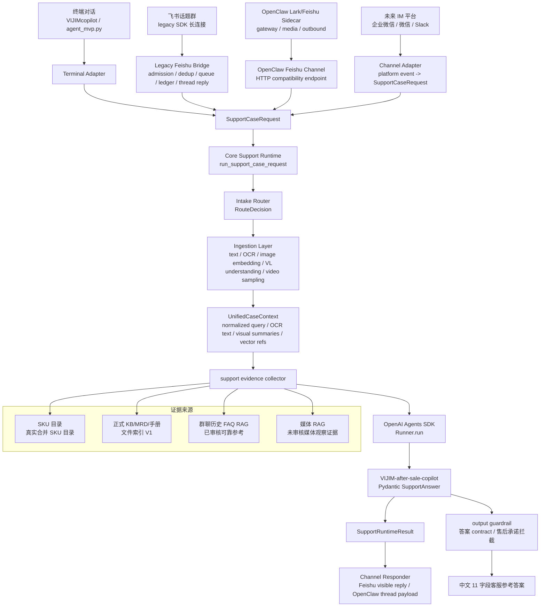

# MVP 架构

## 定位

当前 MVP 是面向售后测试场景的终端优先 **AI 客服参考助手**。

核心规则：

> Agent 可以给建议，最终回复由客服人员判断和发送。

## 当前组件

## 运行原则

- 开发与部署基准固定为：GitHub 是唯一长期代码基准；服务器 `/opt/agent-runtime-dev` 是 Agent Runtime dev 开发工作区；服务器 `/opt/agent-runtime` 是 Agent Runtime 生产部署目录；本地工作区只做轻量调试和快速验证。完整流程见 [development-baseline.md](development-baseline.md)。
- 当前稳定入口是终端对话和 legacy 飞书长连接；OpenClaw Feishu path 已有 compatibility endpoint、smoke contract 和部署清单，真实飞书群 E2E 需要凭证环境验证后再切主。
- 旧 Web Demo 和通用公开 HTTP API 已移除；保留的 HTTP 面只用于受控 channel compatibility endpoint，例如 OpenClaw Feishu sidecar 调用的 `/channels/openclaw-feishu/*`。
- OpenAI Agents SDK 是结构化答案生成、session、tracing 和 output guardrail 层。
- 终端和飞书入口先统一为 `SupportCaseRequest`，再经过 intake route、ingestion artifact 和 `UnifiedCaseContext`；SKU、正式 KB、历史和媒体检索由 runtime 的 `collect_support_evidence()` 基于归一化 query 并发编排，再把统一上下文、数据源覆盖和结构化证据包传给 Agent。
- Core Support Runtime 的边界是 `SupportCaseRequest -> SupportRuntimeResult`。核心售后 pipeline 不 import 飞书 SDK、OpenClaw 或任何 channel 模块。
- Channel Adapter 的职责是把平台事件、消息和附件转换成 `SupportCaseRequest`；Channel Responder 的职责是把 `SupportRuntimeResult` 转成平台回复。OCR、embedding、VL understanding、检索和 Agent 推理都不是 handoff，也不属于 IM adapter。
- Legacy Feishu Bridge 保留 admission、dedup、per-thread queue、reply ledger 和 thread reply；飞书 SDK 细节被限制在 legacy adapter/bridge 层。
- OpenClaw Feishu path 采用 `@larksuite/openclaw-lark` 作为通道能力依赖，本项目只维护薄 compatibility endpoint：OpenClaw message/resource -> `SupportCaseRequest`，`SupportRuntimeResult` -> OpenClaw thread reply payload。HTTP endpoint 默认要求 `OPENCLAW_FEISHU_BRIDGE_SECRET`，生产建议 localhost-only，由 OpenClaw sidecar 持有共享 secret。
- 后续新增企业微信、微信或 Slack 时，新增 `channels/<platform>/adapter.py` 和 `responder.py` 即可接入同一个 Core Support Runtime，不应复制 Agent 编排代码。
- 旧的本地确定性分析器和本地演示知识已经移除。
- 合并后的 SKU 支持目录只用于产品识别和负责人流转，不作为故障依据。
- 正式文档和历史参考必须分开。
- 正式 KB/MRD/手册采用文件索引 V1；当前生产尚未导入真实 KB/MRD/手册资料。如果正式源索引未接入或没有命中，Agent 必须说明“未查询到可信正式依据”。
- 飞书群聊历史 FAQ 进入索引后按业务口径视为已审核，可作为可靠售后参考；它不是正式政策源，不能覆盖正式 KB/MRD/SOP，也不能单独支撑退款、换新、补发、最终判责或客户承诺依据。
- 飞书 raw media 只能作为未审核媒体观察证据；仅命中媒体观察证据时最终动作上限为 `human_review`。附件进入 OCR、视觉 embedding、VL understanding 或 ffmpeg 前必须通过白名单路径/URL 校验，视频还会在 ffmpeg 前做 magic-byte/ffprobe preflight。已下载本地图片可进入 `qwen3-vl-embedding` / `qwen3-vl-rerank` 多模态链路，未下载媒体仍只用于定位图片、视频、截图等待核验素材，不能作为正式技术结论。
- 视觉能力分三层：OCR 负责截图/铭牌/报错图文字提取；image embedding 负责生成 `vector_id` 并驱动媒体向量检索；VL understanding 使用千问 VL 把产品图、损坏图、包装图和视频关键帧转成结构化视觉摘要注入 `UnifiedCaseContext`。
- v1 已生成并保存输入图片的 `vector_id` 引用；运行时 media retrieval 会读取 query vector，与媒体索引向量合并检索。raw vector 不进入 Agent prompt、trace 文本或可见回复。
- 历史话题 RAG 使用阿里云百炼 API 做 embedding 与 rerank。
- 现有 `售后问题 AI 闭环库` Base 可以作为未来已审核历史案例卡片的原始材料，但原始消息不能直接作为正式答案依据。
- `2026AI配置汇总表` 等售前资料只能补充 SKU、基础产品、发票等上下文，不能驱动售后处理决定。
- 低置信度必须对客服可见。
- 禁止承诺退款、赔偿、换新、补发或维修时效。
