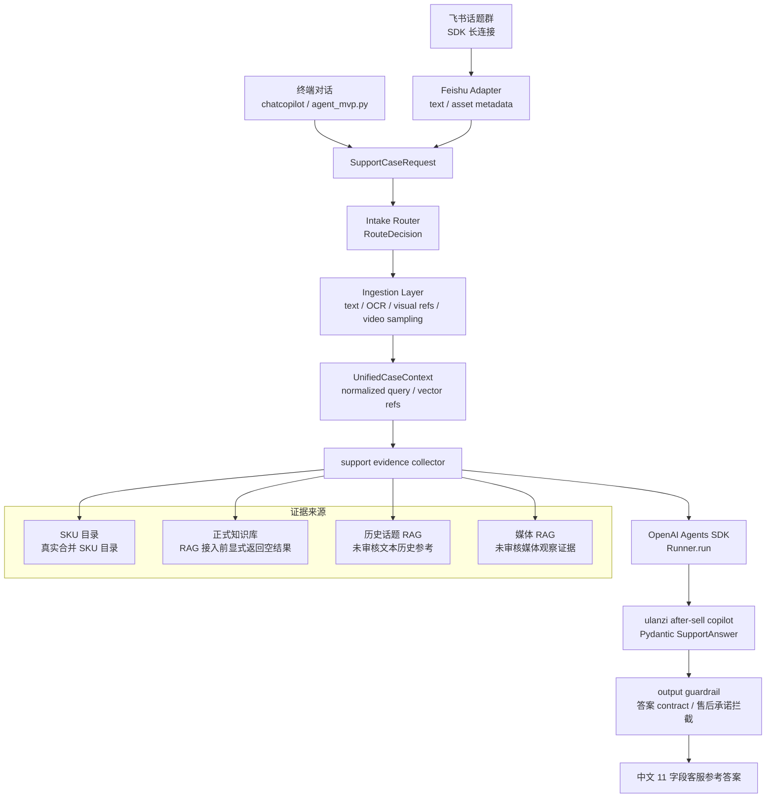

# MVP 架构

## 定位

当前 MVP 是面向售后测试场景的终端优先 **AI 客服参考助手**。

核心规则：

> Agent 可以给建议，最终回复由客服人员判断和发送。

## 当前组件

## 运行原则

- 当前测试阶段只启用终端对话入口。
- Web Demo、HTTP API 和 webhook 运行时已经移除。
- OpenAI Agents SDK 是结构化答案生成、session、tracing 和 output guardrail 层。
- 终端和飞书入口先统一为 `SupportCaseRequest`，再经过 intake route、ingestion artifact 和 `UnifiedCaseContext`；SKU、正式 KB、历史和媒体检索由 runtime 的 `collect_support_evidence()` 基于归一化 query 并发编排，再把统一上下文、数据源覆盖和结构化证据包传给 Agent。
- Feishu Bridge 保留 admission、dedup、per-thread queue、reply ledger 和 thread reply；飞书 SDK 细节被限制在 adapter/bridge 层，核心售后 pipeline 不直接依赖飞书 SDK。
- 旧的本地确定性分析器和本地演示知识已经移除。
- 合并后的 SKU 支持目录只用于产品识别和负责人流转，不作为故障依据。
- 正式文档和历史参考必须分开。
- 如果正式知识库未接入或没有命中，Agent 必须说明“未查询到可信正式依据”。
- 飞书 raw JSON 历史话题 RAG 只能作为未审核历史参考；Agent 必须标注“需人工确认”，不能作为正式政策、正式技术结论、最终判责或客户承诺依据。
- 飞书 raw media 只能作为未审核媒体观察证据；已下载本地图片可进入 `qwen3-vl-embedding` / `qwen3-vl-rerank` 多模态链路，未下载媒体仍只用于定位图片、视频、截图等待核验素材，不能作为正式技术结论。
- 历史话题 RAG 使用阿里云百炼 API 做 embedding 与 rerank。
- 现有 `售后问题 AI 闭环库` Base 可以作为未来已审核历史案例卡片的原始材料，但原始消息不能直接作为正式答案依据。
- `2026AI配置汇总表` 等售前资料只能补充 SKU、基础产品、发票等上下文，不能驱动售后处理决定。
- 低置信度必须对客服可见。
- 禁止承诺退款、赔偿、换新、补发或维修时效。
