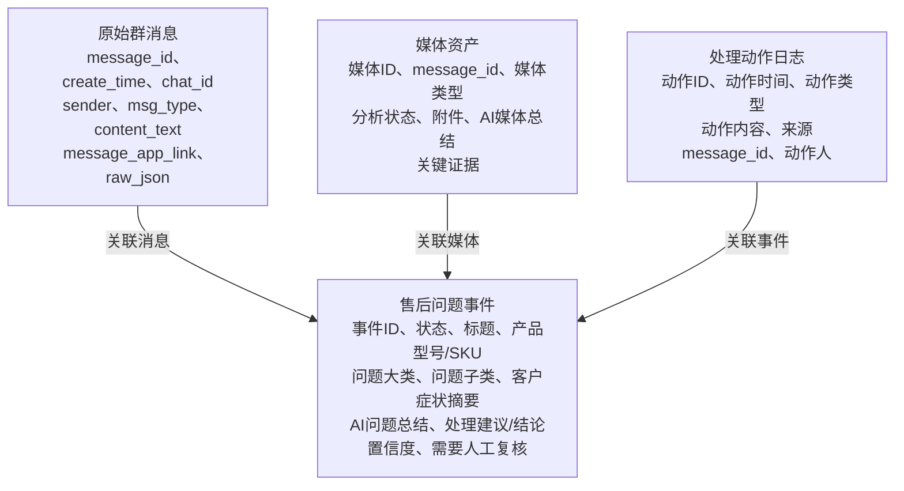
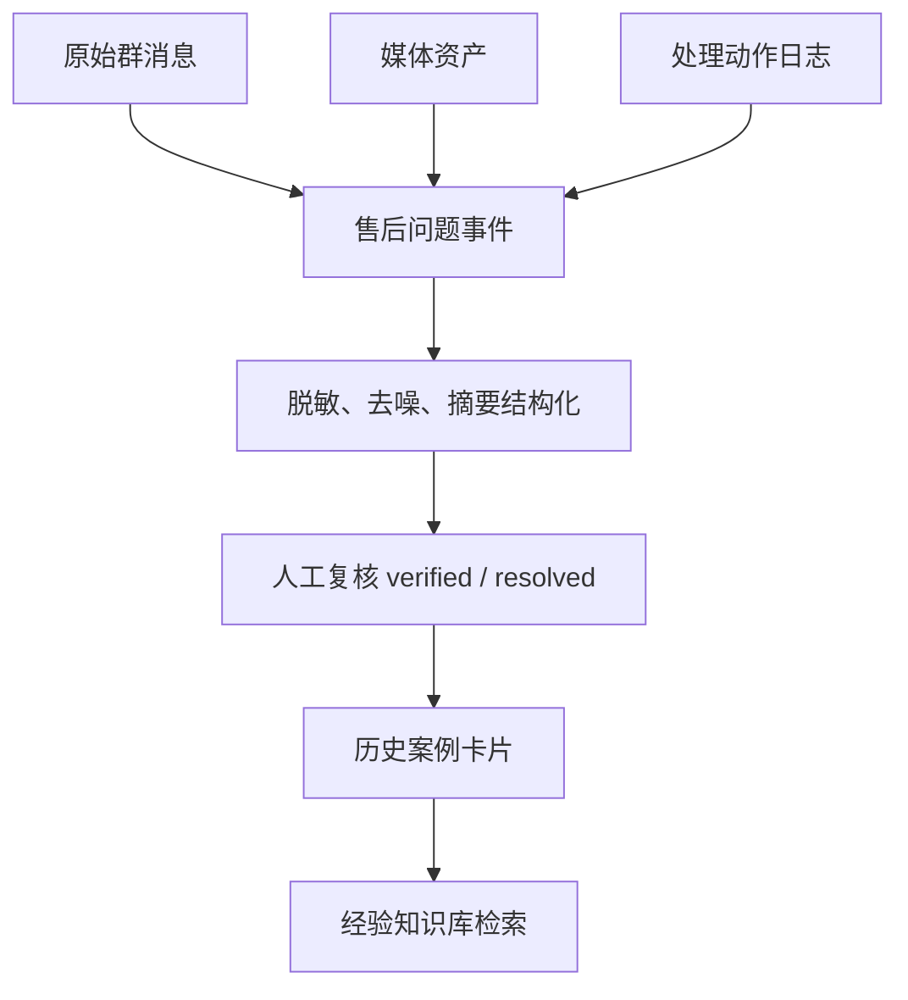

# 现有飞书 Base 原型参考

来源 Base：

- 名称：售后问题 AI 闭环库
- URL：https://ulanzichina.feishu.cn/base/JDWwbG7rRaeoZksPe1TchVyWnif
- 读取日期：2026-05-25
- 状态：参考原型，不是最终产品设计。

## 2026-05-26 采集运行

第一次真实售后群采集运行使用该 Base 作为持久化目标。

来源范围：

- 群聊：`产品质量问题 发错货 售后及其他产品反馈`
- 鲁工 P2P 聊天：项目相关售后和品质上下文。
- 时间窗口：2026-04-26 至 2026-05-27。

写入结果：

- 从飞书 IM 获取 2365 条唯一消息。
- 向 `原始群消息` 写入 572 条新记录。
- 向 `售后问题事件` 写入 852 条新事件候选。
- 向 `处理动作日志` 写入 405 条回复/动作记录。
- 向 `媒体资产` 写入 312 条图片媒体记录。
- 312 条图片媒体记录已验证 `归档文件Token` 和 `归档文件链接`。

归档细节：

- 飞书云盘图片文件夹：https://ulanzichina.feishu.cn/drive/folder/HRdOft9QHlXeCSdAh9hcSMXlnsc
- 本地审计目录：`data/feishu_ingest/20260526-014329`，已被 git 忽略。
- 原生 Base 附件字段仍为空，因为当前附件写入返回 `MOBILE_ONLY`。图片归档约定以 `归档文件Token` 和 `归档文件链接` 为准。

视频和普通文件在本次运行中没有下载为本地媒体文件。它们的资源 key 保留在原始消息 `resource_keys` 中，后续可按需重试。

## 表模型

## 可复用设计信号

- 中心实体应是售后事件，而不是单条聊天消息。
- 原始聊天消息需要通过 `message_id`、`chat_id`、`message_link` 和 `raw_json` 保留可追溯性。
- 媒体应与事件文本分离，再同时关联源消息和事件。
- 处理动作应作为追加式日志保存，不能覆盖事件记录。
- `needs_human_review` 适合作为 MVP 安全字段。
- `confidence` 已存在，但需要规范为清晰的高/中/低规则。
- `status` 已能反映实际售后流程：识别、确认、等待负责人、执行售后动作、关闭。

## 产品化前需要修复

- 部分摘要字段仍接近原始群消息，需要更清晰地抽取症状、根因、解决方案、缺失信息和证据。
- `issue_subcategory` 在样本中填充不足，需要受控分类或未知子类复核流程。
- 产品型号抽取会漏掉小写型号和纯数字型号。
- `confidence` 当前偏数字化和粗粒度，Agent 输出应按证据规则映射为 `高 / 中 / 低`。
- 历史负责人回复可能包含换新、退款、赔偿等动作。Agent 只能把它们作为内部历史处理上下文，不得对客户承诺。
- 原始消息包含人员姓名和可能的客户上下文。用于 RAG 前必须做隐私清理和最小必要保留。
- 当前 schema 没有区分正式依据和历史经验，最终架构必须保持二者隔离。
- 媒体处理只做了部分表示，许多记录仍未分析。媒体摘要应作为可选证据，不要求每条答案都依赖。
- `工单创建日期` 当前是文本字段。运行时负责的时间戳应使用 datetime 字段。

## 推荐接入方式

该 Base 适合作为 MVP 的经验和工单草稿参考层，不应作为正式知识库。

推荐拆分：

- `售后问题事件` -> 售后事件 / 历史案例候选。
- `原始群消息` -> 审计和案例卡片生成的原始追溯。
- `媒体资产` -> 可选多模态证据存储。
- `处理动作日志` -> 负责人回复和处理动作时间线。

最终 RAG 流程应把事件记录转换为经过审核的案例卡片：

## 建议案例卡片映射

| 案例卡片字段 | Base 来源 |
| --- | --- |
| `case_id` | `售后问题事件.事件ID` |
| `product_model` | `售后问题事件.产品型号/SKU` |
| `issue_type` | `问题大类 + 问题子类` |
| `symptoms` | 清洗后的 `客户症状摘要` |
| `root_cause` | 从 `处理动作日志.动作内容` 或已审核结论抽取 |
| `resolution` | 已审核 `处理建议/结论` |
| `resolution_status` | 从 `状态` 映射 |
| `verified` | 人工复核结果，不等同于当前 `需要人工复核` |
| `confidence` | 由数字置信度和来源质量映射 |
| `source_messages` | 关联的 `原始群消息.message_id` |
| `source_media` | 关联的 `媒体资产.媒体ID` |
| `last_verified_at` | 复核时间戳 |
