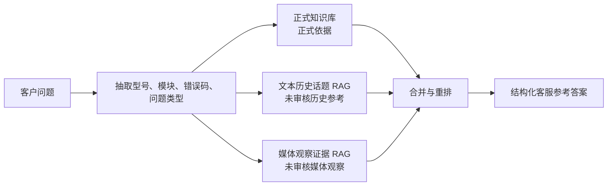
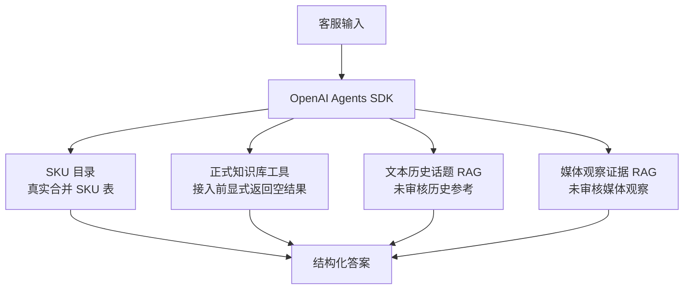
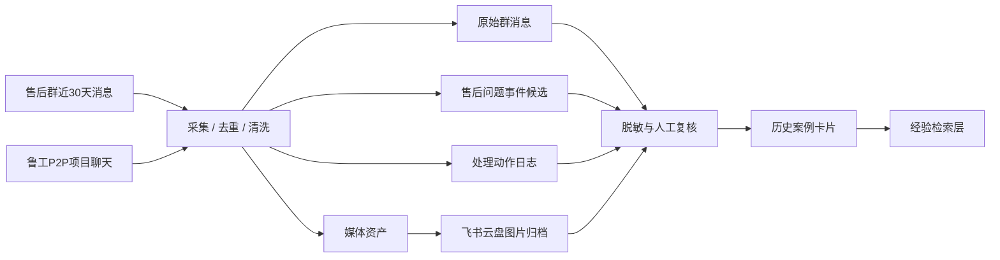

# 知识库设计

## 两类知识库



知识层拆成两个库：

- 正式知识库：产品文档、GTM 文档、QA 规格、说明书、FAQ、排查 SOP、售后政策。
- 历史参考库：飞书售后群话题、真实客户反馈、负责人回复、历史工单。
- 媒体观察库：飞书话题中的图片、视频、截图等媒体元数据和原消息链接，用于定位待人工核验的视觉证据。当前已下载到 staging 的本地图片会使用 `qwen3-vl-embedding` 生成融合向量，并在运行时用 `qwen3-vl-rerank` 重排；未下载媒体仍只做元数据检索。

正式知识库可以作为正式依据引用。当前已接入的飞书 raw JSON 历史话题 RAG 只能作为未审核历史参考，媒体观察库只能作为未审核媒体观察证据；两者都必须标注“需人工确认”，不能作为正式政策、正式技术结论、最终判责或客户承诺依据。

## 当前终端运行时

终端 MVP 不再包含本地演示知识库，也不再使用确定性词法匹配器。

当前检索行为：



当前 SKU 目录是真实可用的，可用于产品身份识别和负责人流转。正式知识库不做假数据兜底：在正式 RAG 源接入前，`hybrid_search_kb` 返回“未查询到可信正式依据”。`search_issue_history` 已升级为混合证据打包：先返回 SKU 精准匹配，再返回文本历史参考和媒体观察证据。文本历史话题默认通过阿里云百炼 `text-embedding-v4` 和 `qwen3-rerank` 调用检索模型；媒体观察证据对已下载图片使用 `qwen3-vl-embedding` / `qwen3-vl-rerank`，对未下载图片/视频保留 raw media 元数据 fallback。所有非正式证据都只能作为内部客服参考。

## 真实飞书采集状态

2026-05-26，第一次真实数据抽取运行已将售后群数据写入飞书 Base `售后问题 AI 闭环库`。

范围：

- 时间窗口：2026-04-26 至 2026-05-27。
- 来源：目标售后群和鲁工 P2P 聊天。
- 获取原始消息：2365 条唯一消息。
- 本次新写入 Base：572 条原始消息、852 个事件候选、405 条动作日志、312 条媒体记录。
- 图片：312 条媒体记录已有 `归档文件Token` 和 `归档文件链接`，指向飞书云盘图片归档。
- 原生 Base 附件字段：未填充，因为当前 Base 附件写入限制为移动端上传。本次采集以云盘文件链接作为图片归档约定。

当前运行时边界：

- 终端 Agent 运行 Agents SDK 路径，并可调用当前工具，包括 SKU 支持目录工具。
- 飞书 Base 采集和话题 raw JSON 已经形成真实历史来源；其中 2026-05-30 至 2026-06-02 的 55 个话题已接入终端历史话题 RAG MVP。
- 当前接入的是未审核历史参考和未审核媒体观察证据。后续如果要升级为更高可信度的历史案例卡片，需要完成隐私清理、症状/根因/解决方案抽取、媒体内容理解和人工复核。



## 正式文档元数据

```json
{
  "source_type": "official_doc",
  "doc_id": "feishu_doc_xxx",
  "title": "A100 App 使用说明",
  "product_model": "A100",
  "product_line": "device",
  "module": "bluetooth_binding",
  "issue_type": "binding_failure",
  "doc_type": "troubleshooting",
  "department": "R&D",
  "version": "2026-05",
  "valid_status": "active",
  "source_url": "https://feishu.cn/docx/xxx",
  "owner": "app_team",
  "updated_at": "2026-05-20"
}
```

## 历史案例卡片

```json
{
  "source_type": "historical_qa",
  "case_id": "CASE-00128",
  "product_model": "A100",
  "issue_type": "app_binding_failure",
  "user_expression_examples": [
    "设备一直绑定不上",
    "App 转圈找不到设备",
    "蓝牙开了还是连接失败"
  ],
  "symptoms": "App 无法绑定 A100，蓝牙权限已开启",
  "root_cause": "设备已被其他账号绑定",
  "resolution": "指导用户解绑旧账号或重置设备",
  "resolution_status": "resolved",
  "verified": true,
  "confidence": "medium",
  "source_messages": ["feishu_msg_1", "feishu_msg_2"],
  "created_at": "2026-04-12",
  "last_verified_at": "2026-05-01"
}
```

## 现有 Base 原型

现有飞书 Base 原型名为 `售后问题 AI 闭环库`。

它应作为经验层参考来源，而不是最终 schema。细节见 [base-demo-reference.md](base-demo-reference.md)。

可复用思路：

- 以 `售后问题事件` 表作为售后事件实体。
- 用 `原始群消息` 表做来源追溯和审计。
- 用 `媒体资产` 表保存图片、视频、文件和关键帧证据。
- 用 `处理动作日志` 表做追加式处理时间线。
- 把 `置信度` 和 `需要人工复核` 作为一等字段。

用于 RAG 前必须改造：

- 清洗和去重原始聊天文本。
- 分离症状、根因、解决方案、缺失信息和证据。
- 入索引前完成隐私清理。
- 增加已审核 `verified` 和已解决 `resolved` 状态。
- 正式依据和历史处理经验必须分开。

## 品质跟进 Base

鲁工共享了第二个 Base：`2026年品质团队跟进事项清单`。

这个 Base 对字段分类和已审核品质跟进记录更有参考价值。细节见 [quality-followup-base.md](quality-followup-base.md)。

用法：

- 作为 `责任部门`、`异常分类`、`状态`、`是否个案`、`问题来源`、`处理方案` 的受控词表来源。
- 作为人工确认后的长期记录目标。
- 只有经过隐私清理和人工复核后，才能作为历史 QA 来源。

鲁工确认的默认规则：

- `数量` 默认 `1`。
- `是否个案` 默认 `是`。
- 批量问题分类需要重复反馈、销量/频次上下文或负责人确认。
- 如果问题归属 `产研/DQE`，可能成为批量问题。
- 非批量问题处理后通常可以标记为 `OK`。

## 检索优先级

1. 产品型号精确匹配。
2. 错误码精确匹配。
3. 正式知识库元数据过滤。
4. 正式知识库关键词或 BM25 检索。
5. 正式知识库向量检索。
6. 历史案例向量检索。
7. 历史案例按时间和已验证状态加权。

核心规则：

> 正式文档优先，历史案例其次。

## 售前补充参考

另有一个飞书表格：`2026AI配置汇总表`。它是售前知识来源，不是售后支持来源。细节见 [presales-knowledge-reference.md](presales-knowledge-reference.md)。

它包含：

- 全平台通用售前话术。
- 按品类、型号和 SKU 组织的产品知识索引。
- 按平台区分的发票话术。

使用边界：

- 允许：SKU/产品名称参考、基础功能解释、高频售前 FAQ 话术、发票参考。
- 禁止：售后诊断、质量结论、保修/换新/退款/赔偿处理、工单结论。

实现规则：

```text
售前来源必须放在独立检索命名空间，不能合并进售后正式知识库或历史案例库。
```
