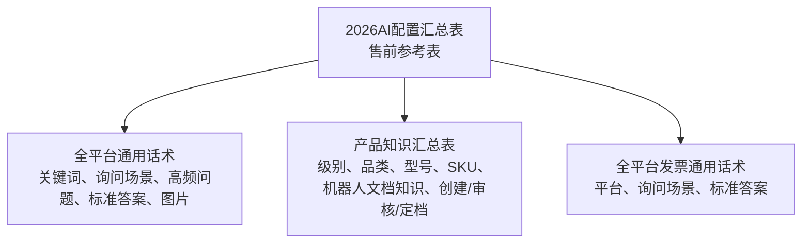

# 售前知识参考

来源：

- Wiki 标题：`2026AI配置汇总表`
- Wiki URL：https://ulanzichina.feishu.cn/wiki/YESIwpMshilwlikWx3scWeNtnRf
- 解析类型：飞书电子表格，不是 Base
- 表格 token：`KQQjsn9gZhlK4MtccSxcssRPnxg`
- 读取日期：2026-05-26
- 在本项目中的作用：仅作为售前补充参考。

## 边界

本项目聚焦售后支持。该售前表不能成为售后 Agent 的主要知识库，也不能用于支撑质量结论、保修处理、换新、退款、赔偿或排查结果。

允许用途：

- SKU 和产品名称参考。
- 基础产品概念和功能解释。
- 高频售前 FAQ 话术作为风格或参考。
- 仅当用户问题明确是发票相关且平台上下文一致时，可作为发票政策参考。

禁止用途：

- 不得把售前话术用于售后诊断。
- 不得把它作为质量问题的正式依据。
- 不得把它作为换新、维修、退款或赔偿等处理政策依据。
- 不得混入历史售后 QA 案例库。

## 工作表



已观察到的工作表：

- `全平台通用话术（定档版）`：通用售前话术库，包括欢迎语、配件概念、兼容基础和使用定义。
- `产品知识汇总表`：产品级索引知识，包括品类、型号、SKU、审核状态、创建人、审核人和定档时间。
- `全平台发票通用话术（定档版）`：按平台区分的发票 FAQ 答案。

## 接入建议

在售后 MVP 中，该来源必须放在独立检索命名空间：

```text
presales_reference
```

建议元数据：

```json
{
  "source_type": "presales_reference",
  "source_name": "2026AI配置汇总表",
  "sheet_name": "产品知识汇总表",
  "knowledge_scope": "presales",
  "allowed_usage": ["sku_mapping", "basic_feature_explanation", "invoice_reference"],
  "not_allowed_usage": ["quality_diagnosis", "after_sales_handling_policy", "ticket_resolution"],
  "source_url": "https://ulanzichina.feishu.cn/wiki/YESIwpMshilwlikWx3scWeNtnRf"
}
```

Agent 只有在问题被分类为以下类型时，才应查询该命名空间：

- 基础产品信息。
- SKU 或产品名称确认。
- 兼容性或使用概念解释。
- 发票相关问题。

对于售后故障、缺陷、客户特定使用问题或质量事件，Agent 应优先使用：

1. 正式售后或产品文档。
2. 已审核品质跟进记录。
3. 历史售后 QA 案例卡片。
4. 依据不足时升级人工处理。
