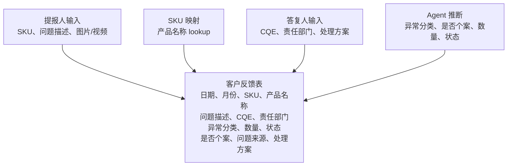
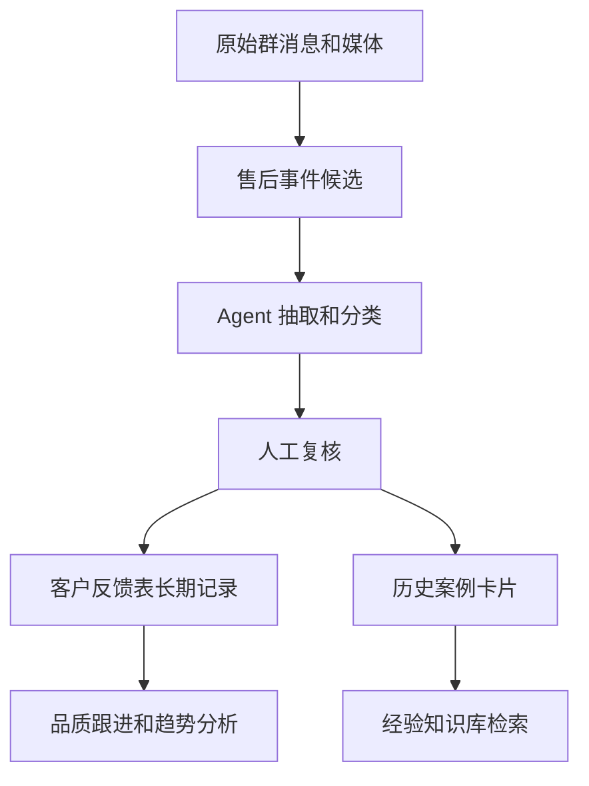

# 品质跟进 Base 参考

来源 Base：

- 名称：`2026年品质团队跟进事项清单`
- URL：https://ulanzichina.feishu.cn/base/EI20b8wd4af3NEsY3YHc6dsXnOh
- 表：`客户反馈表`
- 读取日期：2026-05-25
- 在 MVP 中的作用：品质团队字段分类体系，以及已审核长期记录目标。

## 表字段

核心字段：

| 字段 | 类型 | MVP 含义 |
| --- | --- | --- |
| `日期` | datetime | 反馈日期 |
| `月份` | formula | 由日期派生月份 |
| `SKU` | text | 产品型号锚点 |
| `产品名称` | lookup | 由 SKU 映射派生 |
| `问题描述` | text | 客户症状或问题 |
| `CQE` | select | 负责质量工程师 |
| `责任部门` | select | 责任部门 |
| `异常分类` | select | 问题类别 |
| `数量` | number | 数量，默认 `1` |
| `状态` | select | 进展状态 |
| `是否个案` | select | 默认 `是`；有证据时才标记批量问题 |
| `问题来源` | select | 来源渠道 |
| `处理方案` | select | 已审核处理方案 |

已观察到的选项：

- `CQE`：鲁志强、莫扬凯、谢绮琳。
- `责任部门`：供应商/SQE、客户、物流、产研/DQE、销售、客服、无。
- `异常分类`：功能问题、外观问题、体验异常、客责异常、服务异常、信息咨询。
- `状态`：改善中、无法改善、OK。
- `是否个案`：是、否。
- `问题来源`：售后质量群、小红书对接群、私聊、William反馈、客户群。
- `处理方案`：提供解决视频/方法、更换新品、补发配件、寄回分析、兼容问题、解释原因、使用不当、提供参数。

## Agent 使用方式

Agent 应以两种模式使用该 Base。

模式一：分类体系参考

- 将选项集作为分类的受控词表。
- 使用 SKU 映射方式提醒 Agent：产品型号是主要锚点。
- 使用 CQE 和责任部门作为结构化流转字段。

模式二：已审核记录目标

- 经过人工确认后，准备或写入符合该 schema 的记录。
- 默认值：`数量 = 1`，`是否个案 = 是`。
- 只有当频次、销量上下文或负责人复核支持时，才能标记为批量问题。
- `处理方案` 是内部处理分类，不得直接转成对客户的换新、退款、赔偿等承诺。

## 与现有原型 Base 的关系

- `售后问题 AI 闭环库` 更适合做原始事件采集和追溯。
- `2026年品质团队跟进事项清单` 更适合做已审核品质跟进分类体系和长期记录。

推荐流程：

